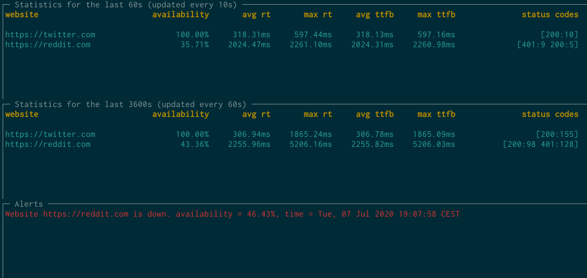

# Website availability &amp; performance monitoring tool

[](https://app.codacy.com/manual/AyoubEd/websites-availability-performance-monitoring-tool?utm_source=github.com&utm_medium=referral&utm_content=AyoubEd/websites-availability-performance-monitoring-tool&utm_campaign=Badge_Grade_Settings)

<p align="center">
  
</p>

_Overview_

- A console program to monitor the performance and availability of websites
- Websites and check intervals are user-defined

_Statistics_

- Check the different websites with their corresponding check intervals
- Compute a few interesting metrics: availability, max/avg response times, max/avg time to first byte, response codes count

_Alerting_

- When a website availability is below a user-defined threshold for a user-defined interval, an alert message is created: "Website {website} is down. availability={availability}, time={time}" (default config threshold: 80%, interval: 2min)
- When availability resumes, another message is created detailing when the alert recovered

_Dashboard_

- displays stats for a user-defined timeframe, stats are updated following a user-defined interval. Default:
  - Every 10s, display the stats for the past 10 minutes for each website
  - Every minute displays the stats for the past hour for each website
- Show all past alerting messages

### Requirements

- [InfluxDB 2.0](https://www.influxdata.com/) - open source time series database
- [Go 1.14](https://golang.org/) - a systems programming language
- [Docker]() - we will use to ease up running an InfluxDB instance

### Installation

#### Building from source

You can customize the update and check intervals in the config.json file at the root of the projects. Defaults are coherant with the assignment specifications.

Build your Go app:

```sh
$ go build
```

Run an InfluxDB instance:

```sh
$ docker run -p 8086:8086 -v influxdb:/var/lib/influxdb influxdb
```

Run your build file:

```sh
$ ./datadog-home-project
```

### Testing

We provided tests for the alerting process. The Go Testing package was used for this purpose.
The 5 scenarios were tested:

    0: got 0 records
    Expected: don't send a "website down" alert

    1: We don't have enough records on the last timeframe, availability <= threshold
    Expected: don't send a "website down" alert.

    2: We have enough records on the last timeframe, availability > threshold, website state is up
    Expected: don't send a "website up" alert.

    3: We have enough records on the last timeframe, availability <= threshold, website state is up
    Expected: send a "website down" alert.

    4: We have enough records on the last timeframe, availability <= threshold, website state is down
    Expected: don't send a "website down" alert.

    5: We have enough records on the last timeframe, availability > threshold, website state is down
    Expected: send a "website up" alert.

To run the test suite, execute the following:

```sh
$ go test -v ./...
```

### Implementation details

The project relies heavily on the built-in concurrency features of Go. All of the following entities are run concurrently using goroutines. All communications are done through go channels, particularly the monitor logs and alerts channel.

All the error management and propagation are done using the excellent "errgroup" package that facilitates managing errors while spanning multiple goroutines.

**Monitor**

The monitor starts concurrent tickers linked to each website. Following a user-defined interval, it sends a request to the website measures a few interesting metrics(response time, time to first byte), and sends the results as a measurement to our logs channel.

**Database**

Responsible for storing the measurements we provide in a time-based manner. It facilitates getting measurements for a particular timeframe.

**Statsagent**

Called by other entities. It computes the stats(avg/max response time, avg/max time to first byte) for the websites we monitor. It also computes the availability of a website over a timeframe.

**Dashboard**

Displays stats about the websites we monitor with user-defined configs(update interval, stats timeframe). It starts concurrent tickers for each view that call stats agent to get the new metrics.

The dashboard also listens to the alerts channel and displays new and past alerts on the GUI.

**Alerting**

It starts a ticker with a user-defined interval that calls the stats agent to compute the availability for a user-defined timeframe. All alerts are sent to an alerts channel that is consumed by our dashboard.

Ps: the alerting ticker interval should be reasonably small to keep accuracy, but not the extent of overloading the database. Using a ticker was a simplification I chose. In a production environment, we may be able to rely on a pub/sub approach to reduce the overload, which InfluxDB supports.

<p align="center">
  
</p>

### Possible improvements

- **Architecture**: In a production environment, it makes sense to split the different entities we mentioned to separate microservices. The real-time communication should then be swapped to account for the change, we can maybe use gRPC streaming or WebSockets, or maybe we can use a message broker.
- **Stats:** We recompute the stats each time we get stats. A possible improvement is keeping a queue of all relevant measurements and compute that stats in a rolling manner.
- **Alerts:** we keep all of our alerts messages in memory. In a production environment, it makes sense to use a caching service like Redis or Memcached.
- **Logging:** all of our alert messages should be logged for historical purposes. It also makes sense to store stats over some indicative timeframes(day stats, week stats, month stats)
- **Installation and deployments**: we should containerize our application to make it easier for people to use and possibly deploy our tool and different environment
